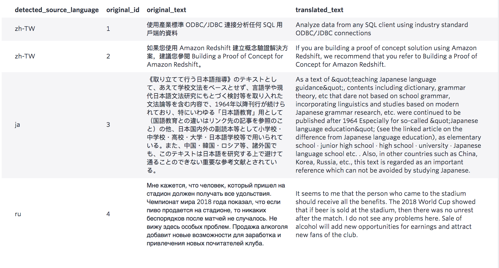

Input: Please name the column you want to translate as text, you can also pass in an id column, this column will be included in the translation result, the only purpose of this column is to make it easier for you to join the result back to the original table. Other columns in the input table will be ignored.

Output: The language of the original text will be automatically detected by the API.

